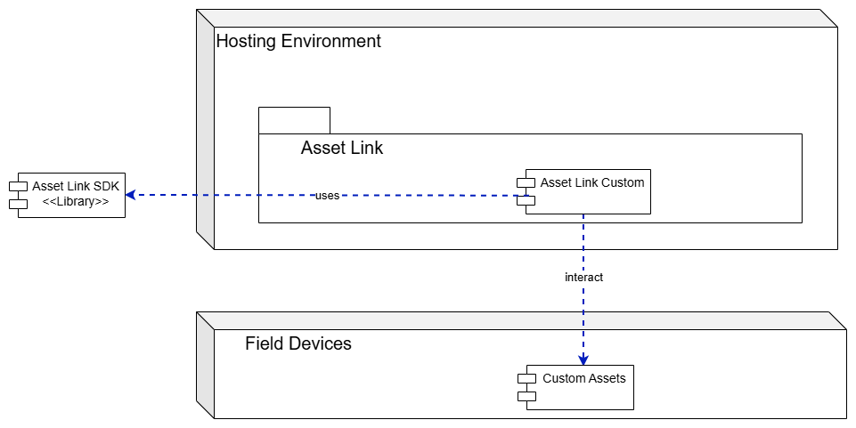

# Asset Link SDK

This repository contains commonly used modules for creating your own
Asset Link (AL).

## Introduction

This package provides an easy-to-use software development kit (SDK) for a device builder.

It contains everything you need to set up your own Asset Link.

## Context

Asset Links are device class drivers used to interact with Operational Technology (OT) assets using different protocols supported by the assets. They act as protocol adapters that enable standardized communication between the [Asset Gateway](https://github.com/industrial-asset-hub/asset-gateway) and diverse OT equipment, regardless of the underlying communication protocol (e.g., OPC UA, Modbus, PROFINET, or proprietary protocols). 
Each Asset Link is deployed as a gRPC server that registers with the gateway, exposing capabilities such as asset discovery and asset management operations. This modular architecture allows Device Builders to extend gateway functionality by creating custom Asset Links tailored to specific asset types or protocols without modifying the core gateway implementation.

## Documentation

The following documentation is available in [docs/](docs/):

- [Overview](docs/overview.md)
- [Bootstrapping your own Asset Link](docs/bootstrap.md)
- [Command line tool](docs/cmd.md)
- [Observability Webserver](docs/observability.md)
- [Working with the Asset Model](docs/model.md)

Documentation is also available to browse online at <https://industrial-asset-hub.github.io/asset-link-sdk/>.

Icon for the Asset Link SDK is from [Siemens IX](https://github.com/siemens/ix).

## Roadmap

The roadmap is tracked via [Github issues](https://github.com/industrial-asset-hub/asset-link-sdk/issues).

## Contributing

Contributions are encouraged and welcome!

See [CONTRIBUTING.md](CONTRIBUTING.md) for details.
