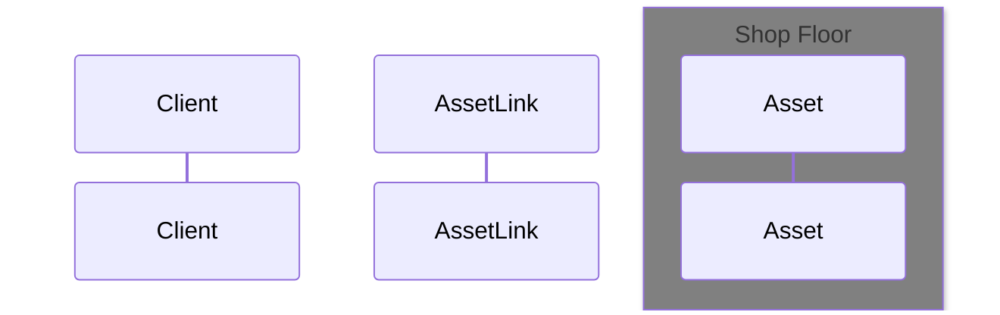
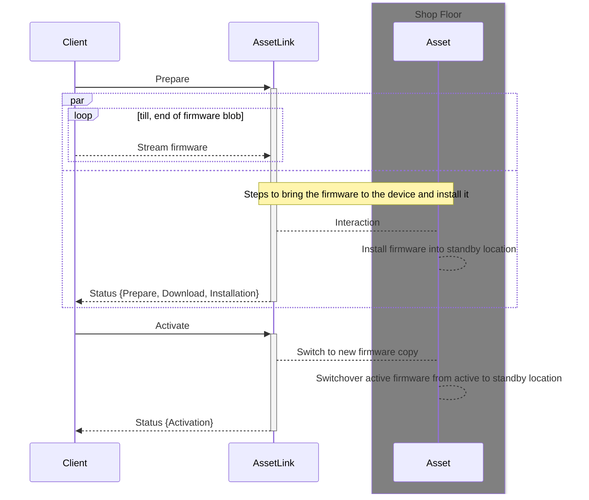

### Firmware / Software Update (!WIP)

There multiple scenarios how an firmware update can be applied.
Modern system often follow an [``double copy`` or A/B](https://sbabic.github.io/swupdate/overview.html#double-copy)
approach. This allows to update the firmware with the possibility to rollback.
In contrast, existing systems often use a ``single copy`` approach, which replaces the existing firmware.

The following section describes how both approaches can be handled.
The term ``firmware`` in the following diagrams represents a firmware or software to it more tangible.

- [ ] Approach to get updated firmware versions

#### Single Copy

Installation of a new firmware is done by replacing the existing one.

#### Double Copy

Installation of a new firmware is done replacing a standby copy and flagging it as
active copy if the operation was successful.
> Note: After the devices successfully booted the new firmware, the term standby and active copy changes, to reflect the new state.

Questions:
- [ ] Approach to handle rollbacks?

#### Generic Artifact Push & Pull

### References
[A/B or Double Copy](https://sbabic.github.io/swupdate/overview.html#double-copy)
